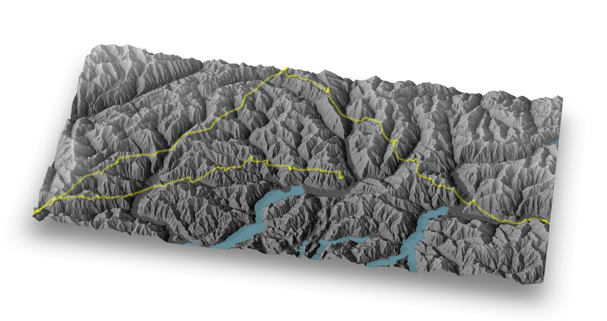

[](https://www.tidyverse.org/lifecycle/#experimental)
[](https://cran.r-project.org/package=geoviz)

# Geoviz

Helper functions to draw [rayshader](https://github.com/tylermorganwall/rayshader) scenes.
- From UK OS Terrain 50, NASA ASTER and EU Copernicus DEM (Digital Elevation Model) data
- With elevation shading (green valleys and snow capped peaks, or anything else you want)
- With map and satellite overlays from ggmap
- with added  GPS tracks

[Rayshader](https://github.com/tylermorganwall/rayshader) is an awesome bit of kit! I'm just doing some colouring in.

### Installing

```R
devtools::install_github("neilcharles/geoviz")
```

Geoviz helps you to draw images like these.




### A note about Google Maps

The example below uses a Stamen map overlay because Google Maps now requires an API key. See [ggmap](https://github.com/dkahle/ggmap).

If you want to do anything Googley with ggmap you'll need to register for an APIkey and before calling geocode() from ggmap or ggmap_image() from geoviz, run the following lines.

```R
library(ggmap)

register_google(key = your_google_key)
```
Google will want billing details but you get plenty of free requests per month before charging begins and you can apply a spend cap of zero if you want to.


### A quick example... see lower down the page for how to do this with your own data


```R
library(geoviz)
library(rayshader)

#Load an example IGC (GPS track log) file

igc <- example_igc

#Load a small example elevation raster showing a piece of the English Lake district

DEM <- example_raster

#Set a few parameters to be used by rayshader (see rayshader's documentation for options etc.)

exaggerate <- 1

increase_resolution <- 1   #useful when you're cropping sections out of your DEM

sunangle = 270

zscale = 25

#Get a Stamen map using ggmap that will cover our DEM

ggmap_overlay <- ggmap_image(DEM, source = "stamen", maptype = "watercolor", zoom = 10)

ggmap_overlay[,,4] <- 0.3  #sets the transparency of this overlay

#Make an elevation shading layer with dark valleys and light peaks (not essential but I like it!)

elevation_overlay <- elevation_shade(DEM, elevation_palette = c("#000000", "#FFFFFF"))

elevation_overlay[,,4] <- 0.6  #sets the transparency of this overlay


#Calculate the rayshader scene (see rayshader's documentation)

elmat = matrix(
  raster::extract(DEM, raster::extent(DEM), method = 'bilinear'),
  nrow = ncol(DEM),
  ncol = nrow(DEM)
)

scene <- elmat %>%
  sphere_shade(sunangle = sunangle, texture = "bw") %>% 
  add_overlay(elevation_overlay) %>%
  # add_water(rayshader::detect_water(elmat), color="imhof4") %>%
  add_overlay(ggmap_overlay)


#Render the rayshader scene

rayshader::plot_3d(
  scene,
  elmat,
  zscale = zscale / increase_resolution / exaggerate,
  solid = FALSE,
  shadow = TRUE,
  shadowdepth = -100
)

```


```R

#Add the gps track

add_gps_to_rayshader(
  DEM,
  igc$lat,
  igc$long,
  igc$altitude,
  line_width = 1.5,
  lightsaber = TRUE,
  colour = "red",
  zscale / increase_resolution / exaggerate,
  ground_shadow = TRUE
)


```


### DEM Data Sources - EU Copernicus

EU coverage.

Copernicus map tiles are large, typically 3-5GB each and covering a country sized area. Download them [here](https://land.copernicus.eu/imagery-in-situ/eu-dem/eu-dem-v1.1?tab=mapview)

```R
big_DEM <- raster::raster("path/to/file/eu_dem_v11_E30N30.TIF")

zscale <- 25
```


### DEM Data Sources - OS Terrain 50

UK coverage. Copernicus also covers the UK if you want to use that instead.

To draw scenes of UK geography using OS Terrain 50 data.

Download [OS Terrain 50](https://www.ordnancesurvey.co.uk/business-and-government/products/terrain-50.html) and unpack it so that you have a "data" directory.

Use the following line to stitch all of the GRID files together into a single raster of the entire UK, or if you don't want to wait that long or have a lower powered machine that can't handle the whole UK mosaic, move a subset of GRID zip files out of the data directory and point the function at that subset instead. 

```R
mosaic_uk_grid("path/to/grid/data/")  #ONLY RUN THIS ONCE TO CREATE THE WHOLE UK MOSAIC RASTER. IT MIGHT TAKE A WHILE.
```

If you find you run out of memory, try these lines before you call mosaic_uk_grid().

```R
library(raster)
rasterOptions(todisk=TRUE)
```

Load the merged raster file

```R
big_DEM <- raster::raster("mosaic_uk_grid.grd")

zscale <- 50
```

### DEM Data Sources - NASA ASTER

Whole world coverage but quite noisy. Copernicus is better if you're mapping in the EU.

Download DEM files from [here](https://search.earthdata.nasa.gov/search/granules?p=C197265171-LPDAAC_ECS&q=aster&ok=aster). Search for "ASTER" in the top left box and select "ASTER Global Digital Elevation Model V002" underneath the map. You won't realistically be able to stitch together a single file of the whole world - it would be enormous - so just download the areas you need.

Stitching together the separate files is the same proces as for OS Terrain 50.

```R
mosaic_ASTER("path/to/data/")
```

If you find you run out of memory, try these lines before you call mosaic_ASTER().

```R
library(raster)
rasterOptions(todisk=TRUE)
```

Load the merged raster file

```R
big_DEM <- raster::raster("mosaic_ASTER.grd")

zscale <- 30
```

### Slicing pieces out of the DEM

You probably don't want to render everything in your DEM data, you'll want to cut out a piece. Geoviz has two functions to help you do this.

Crop out a square around a point...

```R

library(ggmap)

register_google(key = your_google_key)

#Note that the below will only work if you point it at DEM data that contains Keswick! 

coords <- geocode("Keswick, UK")

DEM <- crop_raster_square(big_DEM, coords$lat, coords$lon, square_km)
```

Or crop a section from your DEM to fit a GPS track...

```R
DEM <- crop_raster_track(big_DEM, igc$lat, igc$long, width_buffer = 2)
```

### Loading GPS tracks

You can load GPS track data any way that you like and pass decimal lat-longs as vectors to geoviz functions (see code examples above).

If your GPS data is in IGC format - commonly used for glider flight data - then geoviz has a function read_igc(), which will do all the formatting work for you.

```R
igc <- read_igc("path/to/your/file.igc")
```

### Adding GPS traces to Rayshader scenes

Geoviz converts decimal lat-long GPS traces into rayshader's coordinate system and then plots the GPS track using the funtion add_gps_to_rayshader(). Rather than adding a trace to a scene, if you just want to convert lat-long points into rayshader's coordinates and see the converted data (e.g. so you can add your own arbirary rgl shape to the scene or for use with rayshder's render_label() function), use latlong_to_rayshader_coords().
